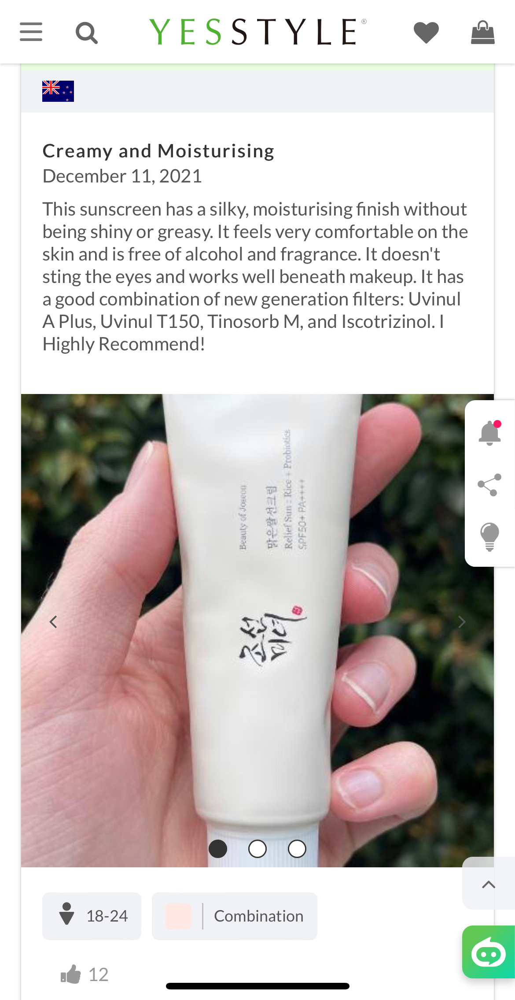
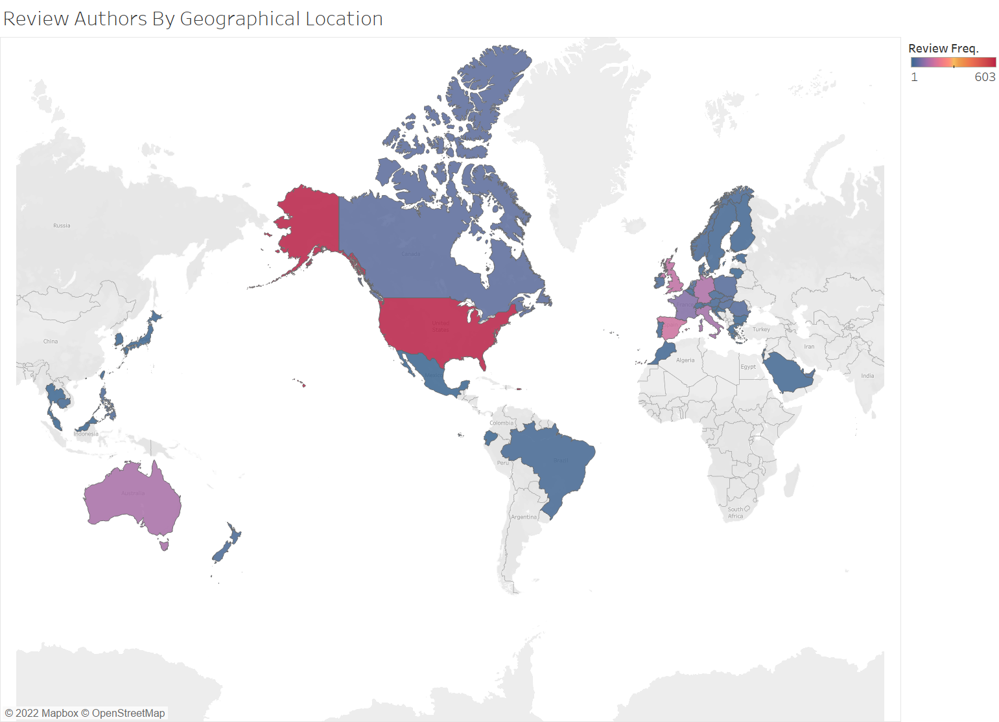
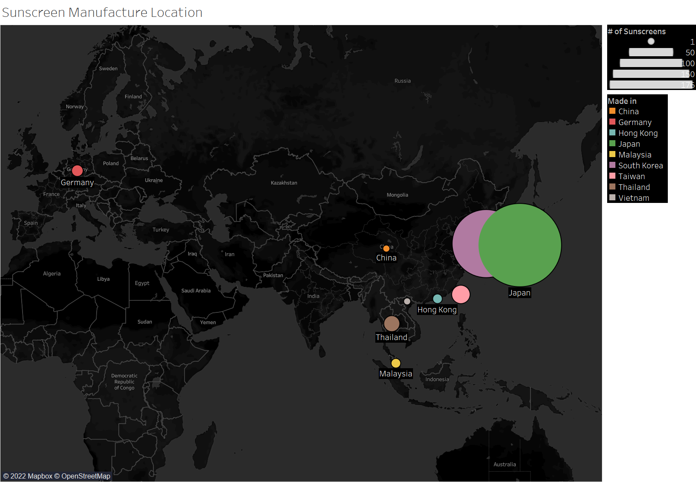
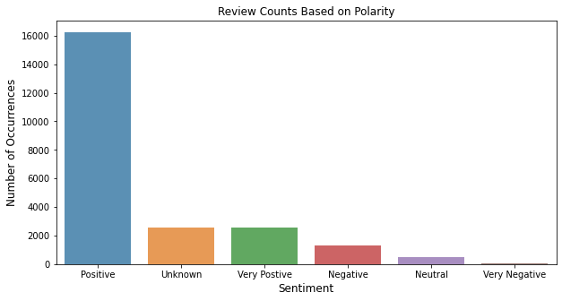
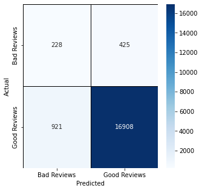

# Project Report

## Goal of analysis
Sunscreens manufactured for the American market are substantially lacking in both appeal and protection. Because of the strict regulations the FDA places on sunscreen filters (the active ingredients in sunscreens), the United States has a limited offerings in terms of sun protection. Many of these approved ingredients cannot obtain the level of protection offered by foreign sunscreens. In fact, a study conducted by the Environmental Working Group of 446 American sunscreens found that close to two-thirds of them would fail to meet European Union standards for adaquate UVA protection. 

Sunscreens on the Korean and Japanese market are noted for both their high protection and their cosmetic elegance, attracting skincare fanatics around the world. Because of the difficulty associated with importing these sunscreens, many companies have been created just to cater to individuals wishing to have a reliable way to obtain Japanese and Korean skincare. This project focuses on the Hong Kong-based [yesstyle.com](yesstyle.com).

As a group that regularly uses foreign sunscreens, we were interested in investigating this site for a number of reasons: 

1. Scraping sunscreen ingredients.
    - We wanted to do a simple statistical analysis of the filters lsited in the best selling sunscreens on [yesstyle.com](yesstyle.com).
    - This gives us answers to a couple of questions: What sunscreen filters are attracting foreign consumers? What are the most popular
    filters used in Korean and Japanese formulas? 

2. Scraping customer reviews.
    - YesStyle has a robust review system, with some products getting thousands of reviews; even allowing users to list their skin tone and 
    skin-type (Dry, Oily, Combination). We wanted to scrape these reviews to gain insight on common complaints and praises used by the
    skincare community. We wanted to assess the frequency of such phrases like: "white cast", "moisturizing", "emollient", etc. 
    - We used the text of the scraped reviews to perform sentiment analysis. We constructed a classification of reviews into categories
    depending on how positive our algorithm perceived them as being. We were then able to correlate the positive sentiment of reviews with
    customer and product attributes to get an idea of what customers valued what attributes the most.

This project gives us a harder challenge than our midterm project, not only in terms of webscraping, but also in terms of our statistical analysis. We're interested consumer behavior and sentiments, looking at a niche and picky market segment that heavily relies on the opinions of fellow skincare enthusiasts to make purchasing decisions. This project also presents a harder data cleaning project, many of the ingredients lists are disorganized and heavily rely on chemical names instead of trade names, meaning that the results wouldn't be translatable unless we convert them. 

## Methodology & Description of Project

Like our midterm project, we used Beautiful Soup, ChromeDriver, Hidden API's and Selinium to scrape product pages of sunscreens on Yes Style. In terms of product information, we focused mostly on ingredients, also collecting data (where available) on product origin, price etc.

Our main scraping goal here was collecting the community reviews that customers leave. We quickly were able to scrape the text content of the reviews, but Yes Style also allows customers to include hard-coded options for skin type, skin tone, age, and country of origin. Where reviewers indicated these options, we attempted to scrape them. We were able to scrape the information from 538 Sunscreens, along with roughly 23,0000 reviews attached to various sunscreens. Below is an example of what reviews look like, along with the extra options that customers can indicate. 

Apologies for the huge image size, but as you can see, this is a typical review with the reviewer's country , skin type (combination), sex, age, and his skin tone (Fair) is noted by the little box next to "Combination". Notice how this reviewer is particuarly concerned about the active sun filters in the sunscreen he is reviewing. 

After we were able to collect the scraped product data, our analysis took off in two directions:

We conducted sentiment analysis using NLP to gauge the polarity of reviews among the customers of Yes Style. Much like our above stated goal, once we had an inital assessment of polarity, we also wanted to look at word frequency among specific groups: organizing people by skin tone and skin type. 
    
The next direction specifically looked at ingredients. As we listed in our goal, we did some simple statisitical anaylsis of ingredients just to gauge their popularity. We also analyzed ingredient popularity based on skin type, to see how discerning members of various types were at picking out and reading ingredients lists. 

 ### Sentiment Analysis Methods

 After getting the scraped data, we used the NTLK package to conduct sentiment analysis on the reviews, filtering out common stop words, making sure the reviews we were analyzing were in English, and filtered out punctuation. We also used a process called lemmatization, which is normalizing the text so that words signifying the same action wouldn't be counted differently. For example, “walk”, “walking”, “walked” would all be casted to a verb part of speech, so that you would have the word “walk” counted three times. 

 Once we went through this "cleaning process" we were able to conduct our analysis. Before looking at sentiments, we were interested in word frequency. We created a counting dictionary of single words, bigrams, and trigrams, organized by count in descending order and took the top 30 most used words to plot in a barplot. Some of these figures are compelling, but don't really have a big part in our analysis of the results, and will be listed in the appendix. For the single word count dictionary and bigrams word count dictionary, we also created a text cloud, for other visualization purposes.  

After looking at word frequncy we used Textblob and NLTK's sentiment analysis features to calculate reviews' positive or negative polarity. We then used the star rating on Yes Style to gauge the accuracy of our predicting algorithm, seeing if high-starred reivews were correctly identified as positive. 

### Ingredient Analysis Methods 

The ingredient analysis part of this project is pretty straight-forward. Once we had the initial data, we first had to clean the raw data because many ingredients are un-recognizable. Ingredients are typically listed as their chemical name but are typically talked about in normal conversation using their trade name. For example, methylene bis-benzotriazolyl tetramethylbutylphenol is commonly known as Tinosorb M. We first created code and a dictionary to convert these ingredients to their trade names, placing it into a dataframe. After a basic look at simple ingredient popularity, we then looked at the most popular ingredients among different skin types. 

#### Note on Database Usage 

We complied some of our collected data into a PostgresSQL database, creating two tables. We then formed quereries and used Tableau to create visualizations, we will point out when these tableau visualizations pop up. 

Now, let's head on down to findings!

## Data and Findings

Okay! Let's take a look at some imitial plots of our review data.

Let's start with with our first Tableau plot.

Below is a map of all of the reviews scraped, as you can see most customers find themselves in the United States of America. However, it appears that YesStyle has a lot of fans in the European Union, Australia, and the UK as well. This is a surprising result! Why?

Well as mentioned before, Europe and Australia (think hole in the ozone) have some of the strictest requirements for sun protection within their sunscreens. These countries also have access a broader range of filters, much like Asia. One hypothesis is that Asian sunscreens offer something more than just sun protection, their formulas could be more cosmetically elegant or have more soothing ingredients compared to those available on the European or Australian market. 

Let's have a quick chat looking at the other map created in Tableau, this one shows where the majority of our sunscreens were manufactured. Please keep in mind that because of the nature of incomplete information on YesStyle, not all of the sunscreens have a manufacturing country listed. But looking at the map below as a sample, we can pretty confidently say the majority of sunscreens are manufactured in Japan or South Korea.

Focusing on reviews in English: 

Next, let's now take a look at the word frquency plots scraped from our reivews. Initially, we looked at one-word frequency, but this plot was not that interesting because people mention the word "sunscreen", similar results happened when we looked at two word frequency. These plots, along with their respective world clouds are listed in the appendix.

Looking at the most telling data, here is the plot of a Trigram, basically the most commonly used groups of three words amongst reviewers:

Looking at this plot it appears that most Sunscreen purchasers are concerned about "White Cast", which refers to sunscreen appearing white on skin. A sunscreen having a white cast is typically considered a negative. Skin concerns also seem to be frequently mentioned, like acne and dryness. 

Okay, now onto Sentiment Analysis.

After using Text Blob and NLTK to get polarity readings (output is a number) for all of the English reviews, we made a simple bar graph looking at the frequency of polarity ratings. Polarity refers to the overall sentiment of a comment.

Looking at the graph below, you can see that most reviews are rated as positive, followed by unknown (indicates non English or strange formatting), followed by Very Positive, Negative, Neutral and then Very Negative.

It appears that most people who review Sunscreen on YesStyle enjoy their purchase. However, because NLP algorithms are not perfect, the overwhelmingly positive result may be misleading.

To gauge the accuracy of Text Blob and NLTK's predictions, we created a way to "test" actual rating versus predicted ratings using the star rating system found on YesStyle. For the simplicity of analysis, instead of five different polarity categories, we re-sorted our data into positive and negative ratings. This became our predicted data. Using dummmies sorted from star ratings, we used this a measure for the true sentiment of a review. Reviews with star ratings above .6 we deemed positive, reviews at .4 and below were deemed negative. 

Below is the confusion matrix resulting from comparing the predicted and actual data. 

From the confusion matrix, it appears that the algorithm correctly predicted 16,908 good reviews and 228 negative reviews. However, the algorithm determined 921 good reviews as bad and 425 bad reviews as good. It appears that the algorithm is good at predicting positive reviews, but it's not so good at percieving negativity. However, the data is already overwhelmingly positive.  

## Limitations of analysis
Sentiment analysis is hard to fine-tune, so we encountered errors where our Textblob algorithm could not understand the context of some customer reviews. For example, customer reviews that had double negatives were falsely flagged as being negative. If a reviewer were to say something like, "this product does not make me break out with acne," which is a positive review, our Textblob would see the "not" and classify it as negative. We were able to mitigate this problem by simplifying our review classes to three levels of sentiment where before we had five, and our classification became more accurate. However, we are likely missing some nuance in our classification of language.

We also don't have complete information about customers--only a subset of customers leave reviews, and of those reviews, only some leave information about their skin type or where they're from. If we had more complete data, we could have perhaps trained our sentiment analysis algorithm better and had more data to present about Yes Style's customer base.

## Extensions of analysis/areas for more research
If we had been able to scrape more comments and provide supervision for our sentiment analysis program, we could have perhaps trained its classification to be more accurate. Instead, we were limited to a built-in sentiment analysis feature in an NLP package.

Additionally, if we had more complete data on product sales, we could have mined valuable insights into what makes certain products sell more. We also could have constructed a regression to find how much different features contribute to price.

## Source of datasets
We scraped the top rated sunscreens from [yesstyle.com](yesstyle.com), including product information and customer reviews.

## Reproducibility
In order to rerun the analysis, you will need to install the requirements which contains all the necessary packages, and then run the files in a certain order.

In order to install the requirements, you will need to run "pip3 install -r requirements.txt"

Once these pacakges are installed, the order of running the files is as follows:

These first two scripts are used to scrape the initial data from YesStyle for product listings and reviews. These scripts are not neccessary to reproduce our analysis as the final dataset is included in the data folder. The Selenium scraper may run into fake user issues and Google Vertex AI issues, YesStyle has a chance to detect the scraper, and reject the scraper's request for data. Because the Google Vertex AI may or may not have a browser, the Selenium Scraper may not open Chrome properly.

1. Run link_df_scraper.py
2. Run product-info.py
4. Run comment_scraper.py

These scripts are meant to clean the reviews and ingredients for product listings and create our plots

4. Run skin_wreviews.py
5. Run skin_analysis.py
6. Run comment_w_rating.py
7. Run Skin_plot_and_nltk_regroup.ipynb
8. Run Type_and_ingredient.ipynb

9. Run the ingredients code

